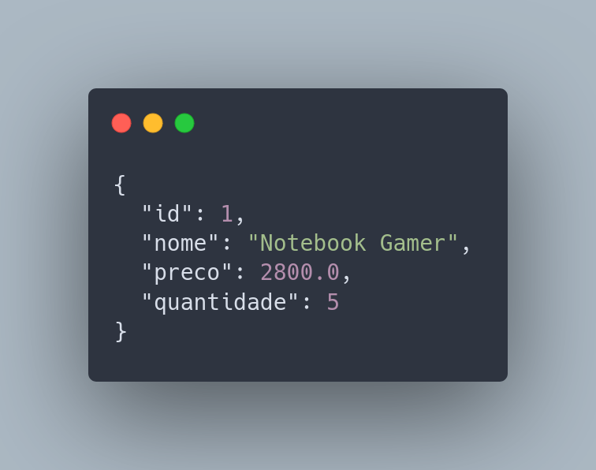

<h1 align="center">
<br />
  
  <br />
  <b>API de Gerenciamento de Produtos</b>
  <br />
  <sub><sup><b>(PRODUCTS-API)</b></sup></sub>
  <br />
</h1>

<p align="center">
  Uma API RESTful desenvolvida com Spring Boot para gerenciamento de produtos. Essa aplicação foi projetada para operações básicas de CRUD (Create, Read, Update e Delete) utilizando Java 21, banco de dados H2 e as melhores práticas do Spring Framework.
</p>

<p align="center">
  <br />
  
</p>

---

## 🚀 Descrição Geral

Essa API permite:
- Criar novos produtos no sistema.
- Buscar todos os produtos ou um produto específico por ID.
- Atualizar total ou parcialmente produtos existentes.
- Excluir produtos do banco de dados.

Foi implementada usando Spring Data JPA para abstrair as operações de banco de dados e um banco H2 em memória para facilitar os testes locais. A API é totalmente documentada no arquivo README.

---

## 🖥️ **Configuração do Ambiente**

### Pré-requisitos
- [**Java 21**](https://www.oracle.com/java/technologies/javase/jdk21-archive-downloads.html): Certifique-se de que está instalado e configurado no ambiente.
- [**Maven**](https://maven.apache.org/download.cgi): Necessário para gerenciar dependências e executar o projeto.
- **IDE recomendada**: [**IntelliJ IDEA**](https://www.jetbrains.com/idea/download) (opcional, mas recomendado para melhor produtividade).

---

### Configuração Inicial

1. **Clone o repositório**:
   ```bash
   git clone https://github.com/FelipeRibeir0/ApiSpringBoot.git
   cd ApiSpringBoot
   
2. Execute o projeto:
   ```bash
   mvn spring-boot:run
   ```

3. A API estará disponível em:
   ```
   http://localhost:8080
   ```

4. Para acessar o console do banco de dados H2:
   ```
   http://localhost:8080/h2-console
   ```
   - **JDBC URL**: `jdbc:h2:mem:produtosdb`
   - **Usuário**: `sa`
   - **Senha**: *(deixe vazio)*

---
# 📄 Documentação da API

Este projeto disponibiliza uma API que pode ser acessada e testada diretamente através da documentação gerada pelo Swagger.

## Acessando a documentação Swagger

Após rodar a aplicação, a documentação do Swagger estará disponível na seguinte URL:
[Swagger](http://localhost:8080/documentacao)

### Passos para acessar a documentação:

1. Certifique-se de que o projeto está rodando localmente ou em um ambiente de desenvolvimento.
2. Abra seu navegador e acesse a URL: http://localhost:8080/documentacao
3. Você verá a interface gráfica do Swagger UI, onde poderá explorar todos os endpoints da API e fazer chamadas de teste diretamente pela interface.
---

## 🌐 Endpoints da API

<table>
  <tr>
    <th>Método</th>
    <th>Endpoint</th>
    <th>Descrição</th>
  </tr>
  <tr>
    <td>GET</td>
    <td>/produtos</td>
    <td>Retorna a lista de todos os produtos. Aceita um parâmetro opcional de busca por nome.</td>
  </tr>
  <tr>
    <td>GET</td>
    <td>/produtos/{id}</td>
    <td>Retorna os detalhes de um produto específico pelo ID.</td>
  </tr>
  <tr>
    <td>POST</td>
    <td>/produtos</td>
    <td>Cria um novo produto no sistema.</td>
  </tr>
  <tr>
    <td>PUT</td>
    <td>/produtos/{id}</td>
    <td>Atualiza completamente as informações de um produto existente.</td>
  </tr>
  <tr>
    <td>PATCH</td>
    <td>/produtos/{id}</td>
    <td>Atualiza parcialmente as informações de um produto existente.</td>
  </tr>
  <tr>
    <td>DELETE</td>
    <td>/produtos/{id}</td>
    <td>Exclui um produto do sistema pelo ID.</td>
  </tr>
</table>

---

## 🛠️ Técnicas e Tecnologias Utilizadas

  - <b>Spring Boot:</b> Framework principal da aplicação.<br />
  - <b>Spring Data JPA:</b> Gerenciamento de dados usando ORM.<br />
  - <b>Banco de Dados H2:</b> Banco em memória para testes.<br />
  - <b>Java 21:</b> Linguagem utilizada.<br />

---

## 📂 Estrutura do Projeto

```🌐
src
├── main/
│   ├── 📂 java/com/firstAPI/
│   │   ├── 📂 Controller        [Definições de rotas e lógica básica da API]
│   │   ├── 📂 Service           [Regras de negócio e validações]
│   │   ├── 📂 Model             [Modelos de dados (Entidades)]
│   │   ├── 📂 Repository        [Repositórios para abstração de acesso ao banco de dados]
│   └── 📂 resources/
│       └── 📂 static/ 

```

# Considerações Finais

Esta API foi desenvolvida como um exemplo prático para quem está aprendendo Spring Boot. Ela é simples, funcional e facilmente extensível.

Possíveis melhorias futuras:

- 🔒 Adicionar autenticação com JWT.
- 🛢️ Migrar para um banco de dados persistente (PostgreSQL, MongoDB, MySQL).
- 🧪 Adicionar testes unitários e de integração.

